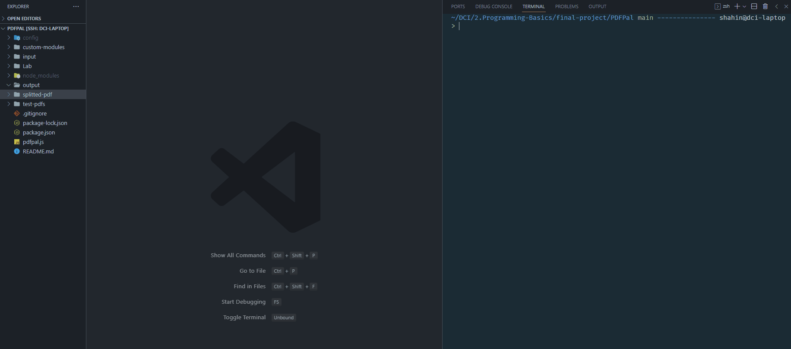
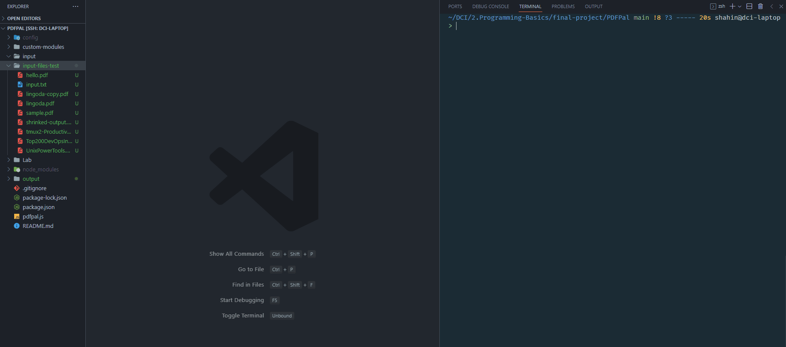
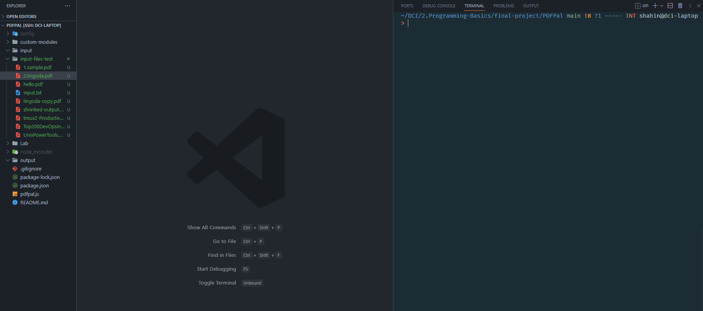
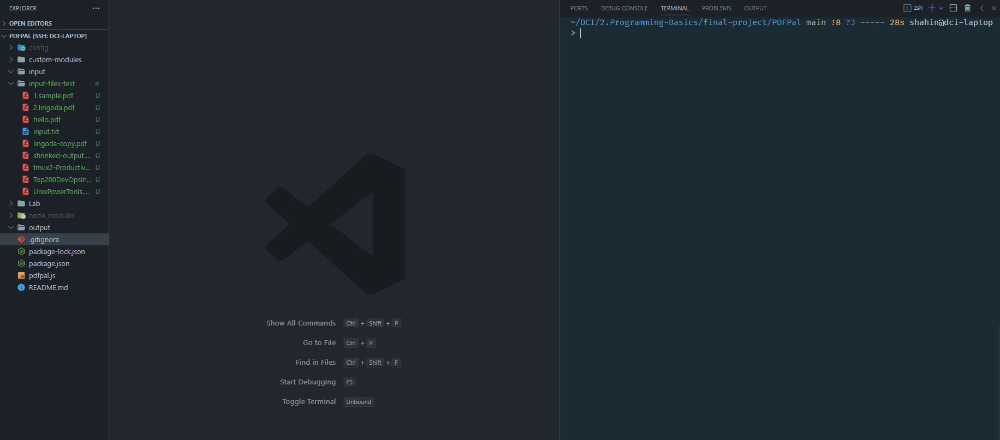
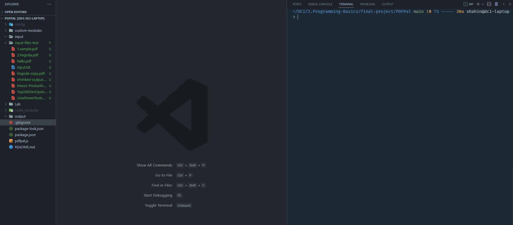
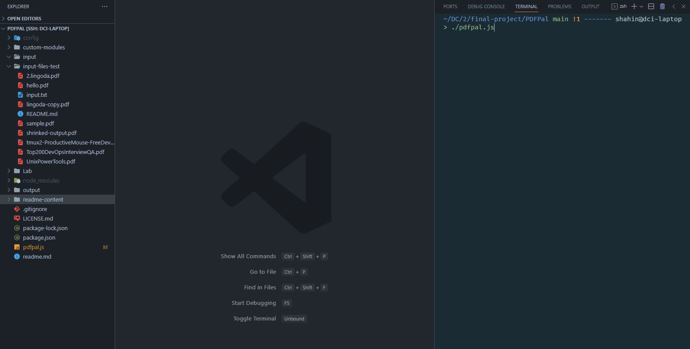
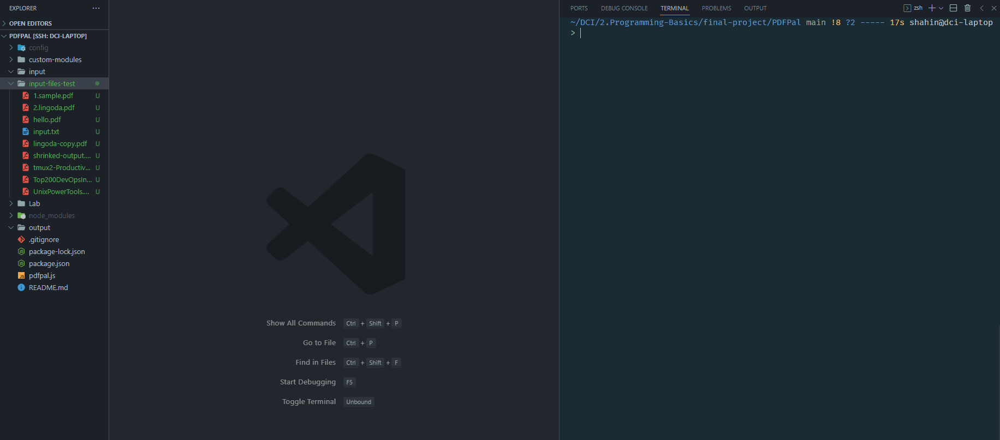
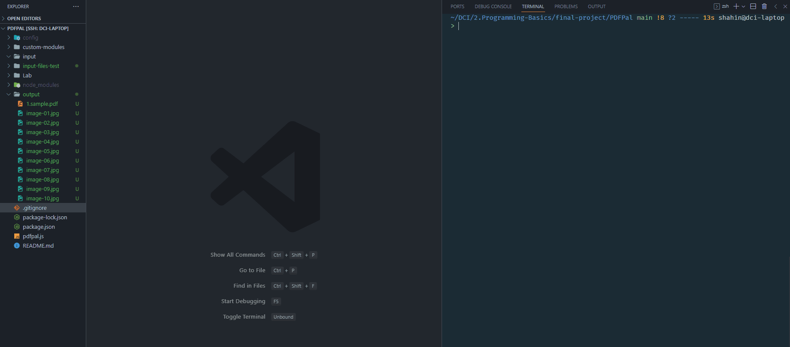
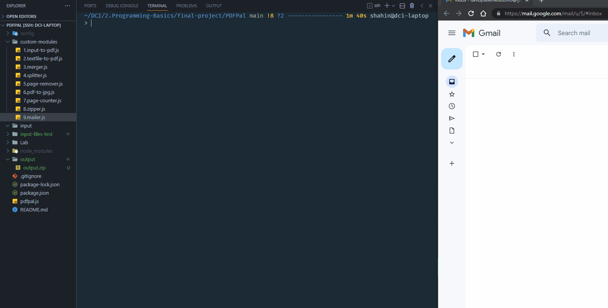

# PDFPal

<p align="center">
    
</p>

### TL;DR

If you want a CLI based node.js tool which can do any of the following tasks:

1. Convert multiline input to a PDF file.
2. Convert a Text file into a PDF file.
3. Merge multiple PDFs.
4. Split a PDF into separate PDFs.
5. Remove PDF page(s).
6. Convert a PDF to JPG files.
7. Count the number of PDF pages.
8. Zip the files in output directory.
9. Email the PDF file.

Then clone the repo.

make sure that pdfpal.js has execution permissions with `chmod +x ./pdfpal` 

Install the necessary packages with `node install`

and then run `./pdfpal` and choose the number of your desired tool and continue based on instructions.

---

## ℹ What is PDFPal?

PDFPal like PayPal is a user-friendly PDF manipulation tool. 

Just like linux commands it does only one thing at a time!

For example: 

1. It can convert multiline input into a PDF. the multiline input can also be more that one page.
2. It can convert a text file into a PDF file and in order to do that you only need to put your PDF file into input folder.
3. It can merge multiple PDF files together. for example you have file1.pdf and file2.pdf and you want to merge them together then you can put your files into input folder and then run PDFPal and enter 2 and press enter. Depending on your file size the operation will take from a few milliseconds up to a few seconds and then file2 will be added to the end of file1 and then the merged file can be fetched from output folder.
4. It can split a PDF into a separate PDFs. which means for example if you give it a 20 page pdf file, it will generate 20 pdf files based on each page file the input pdf into output folder. 
5. It can remove a single page or multiple pages at once.
6. It can convert a pdf file into jpeg file based on the users given range.
7. It can count the number of pages of a pdf file. 
8. After applying any of the PDF manipulation mentioned above, you can use PDFPal to create a zip file based on all of the files inside the output folder.
9. And at last you can send any file located in output folder to any email address. 

---

### 🤔 Inspiration:

Actually PDFPal is my project, when DCI’s Programming basics module was over. I always wanted to create a tool which can work with files and after some research, while I’m a fan of [ilovepdf.com](http://ilovepdf.com) website, I thought why not create a trimmed down, CLI version of ilovepdf! 

---

### 👨‍💻 Installation:

First clone this repo:

```bash
git clone git@github.com:shahinam2/PDFPal.git
```

Then make sure that pdfpal.js has execution permissions:

```bash
chmod +x ./pdfpal.js
```

Install the packages:

```bash
node install
```

Start using PDFPal:

```bash
./pdfpal.js
```

> PDFPal works best with node version v18.10.0
> 

---

### ⚙ Libraries used in this project:

- readline → used to get the user inputs
- fs → used to interact with the file system
- colors → used to make texts colorful, including the PDFPal welcome message.
- pdfkit → used to generate PDF files.
- puppeteer → used to generate pdf file based on a text file. but this library can do a lot more!
- pdf-lib → used to manipulate pdf files in this project. which is one of most popular pdf manipulator among all npm packages.
- path → used to resolve user input relative paths.
- child_process → used to run linux command line from within node.js
- pdf-parse → used to count the number of pages in a pdf file
- adm-zip → used to zip the contents of the output folder
- dotenv → used to store email password as environment variable
- nodemailer → used to send email

---

### ⁉ Examples in action:

1. The following is an example of converting user input to pdf:
    
    
    

1. The following is an example of converting a text file into pdf:
    
    
    

1. The following is an example of merging two files together:
    
    
    

1. The following is an example of splitting a pdf file:
    
    
    

1. 1.The following is an example of removing a page from a pdf file:
    
    
    

1. 2.The following is an example of removing a range of pages from a pdf file:
    
    
    

1. The following is and example of converting a range pdf pages to the corresponding jpeg files. By starting this module, the program will make sure that “poppler-utils” is up and running in your machine.
    
    
    

1. The following is an example of counting the pages of a pdf:
    
    
    

1. The following is an example of zipping any file in output folder:
    
    
    

1. The following is an example of sending the generated file as email.
    
    
    

> Unlike other modules this module requires a little bit of effort from user. to enable this module the user should watch this video: [https://www.youtube.com/watch?v=uVDq4VOBMNM](https://www.youtube.com/watch?v=uVDq4VOBMNM) and store the “app password” inside ./config/.env file.
> 


---

### 🎯 PDFPal Project's Aim/Status:

At the time of writting this readme I’m at the end of 3rd module of DCI’s one year web development bootcamp which was all about javascript and node.js and everything in this module was CLI based. In the upcoming module we are going to learn about react. which is module 4. which module 4 is over I’m going to create a GUI for PDFPal.

After module 5 I’m going to add authentication, database, self-host and dockerize PDFPal.

---

### 🦾 Sources used to make this project possible:

1. The documentation of all modules mentioned above.
2. For merger.js:
    1. [https://blog.logrocket.com/managing-pdfs-node-pdf-lib/#how-to-manage-pdfs-node-js-pdf-lib](https://blog.logrocket.com/managing-pdfs-node-pdf-lib/#how-to-manage-pdfs-node-js-pdf-lib)
3. For splitter.js:
    1. [https://www.labnol.org/split-pdf-file-220406](https://www.labnol.org/split-pdf-file-220406)
4. For pdf-to-jpg.js
    1. poppler-utils linux command
5. For zipper.js
    1. [https://www.digitalocean.com/community/tutorials/how-to-work-with-zip-files-in-node-js#step-2-creating-a-zip-archive](https://www.digitalocean.com/community/tutorials/how-to-work-with-zip-files-in-node-js#step-2-creating-a-zip-archive)
6. For mailer.js:
    1. for sending email:
        1. [https://www.w3schools.com/nodejs/nodejs_email.asp](https://www.w3schools.com/nodejs/nodejs_email.asp)
    2. for adding user file as attachment:
        1. [https://nodemailer.com/message/attachments/](https://nodemailer.com/message/attachments/)

 

---

### 📝 Notes:

- The .js files inside the custom-module folder are called from the main file which is called pdfpal.js file, but they can also be used separately.

---

### 🤝 Contribution:

Contributions, issues and feature requests are welcome!

---

### ⚖ License:

This project is MIT licensed.